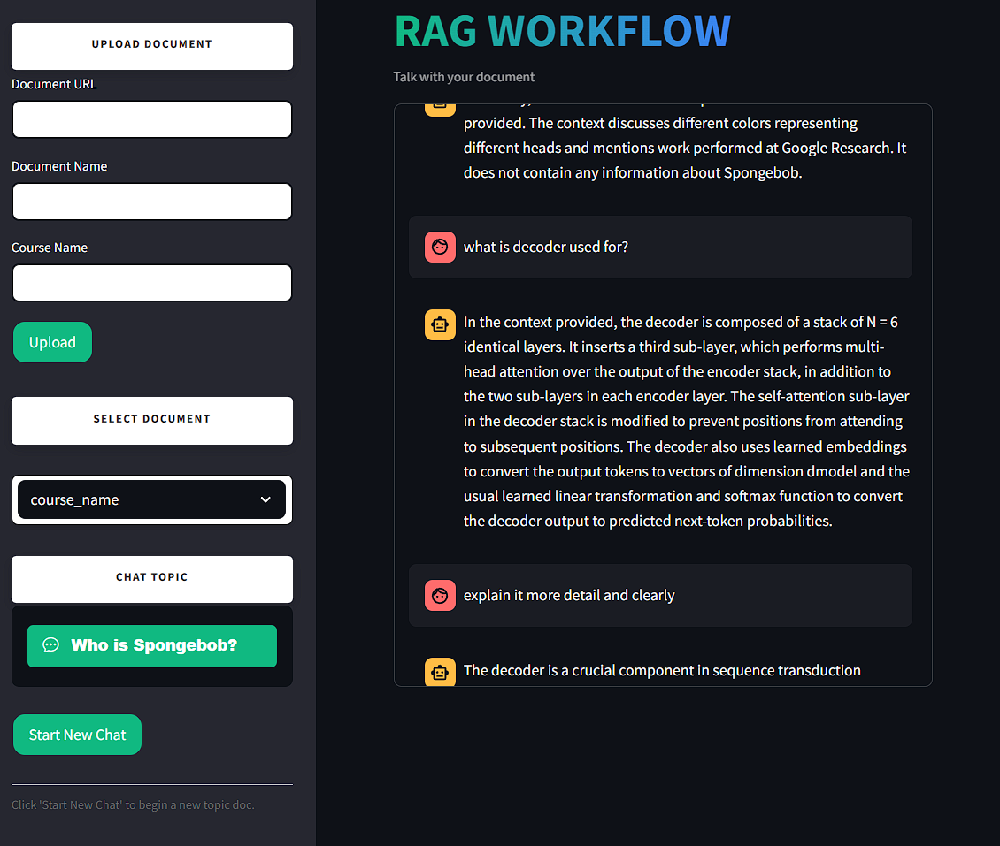

# RAG Workflow and Semantic Chunking



A Streamlit-based application demonstrating a Retrieval-Augmented Generation (RAG) workflow with semantic chunking, leveraging Google Gemini APIs and AstraDB for vector storage and retrieval.

---

## Environment Variables

Create a `.env` file in the project root and populate it with the following keys:

```dotenv
GOOGLE_API_KEY=your_google_api_key_here
ASTRADB_API_ENDPOINT=https://your-astra-endpoint
ASTRADB_TOKEN_KEY=your_astradb_token_here
ASTRADB_KEYSPACE_NAME=your_keyspace_name
ASTRADB_COLLECTION_NAME=your_collection_name

Note: Keep your .env file secret and do not commit it to version control.
```

---

## Getting Started

To get a local copy up and running follow these simple steps.

1. Clone the repository

Using HTTPS:
```bash
git clone https://github.com/fawazatha/RAG-WORKFLOW.git
```

Or using SSH: 
```bash
git clone git@github.com:fawazatha/RAG-WORKFLOW.git
```

2. Navigate into the cloned directory: 
```bash
cd RAG-WORKFLOW
```

3. Create and activate a virtual environment (recommended)
```bash
python -m venv .venv
source .venv/Scripts/activate
```

4. Install the required Python packages. 
```bash
pip install -r requirements.txt
```

---

## Usage
```bash
python rag_ui.py
```